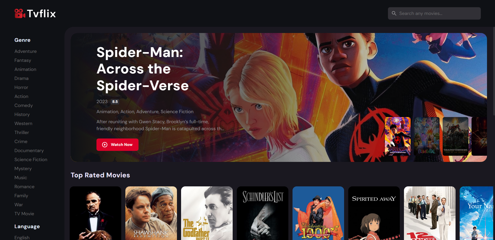
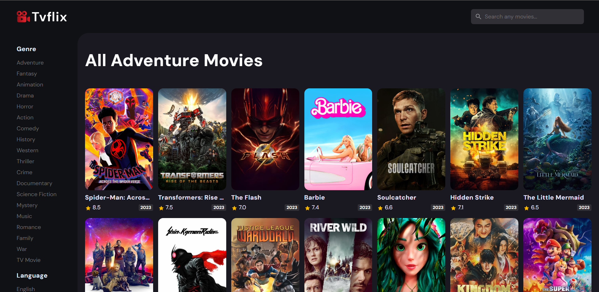
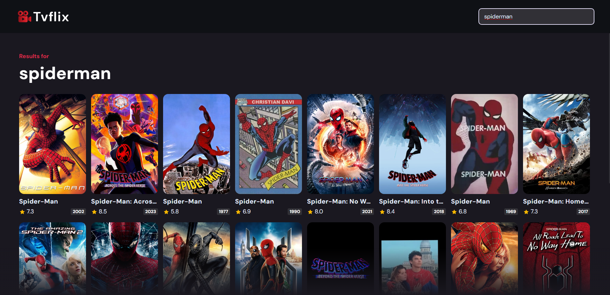
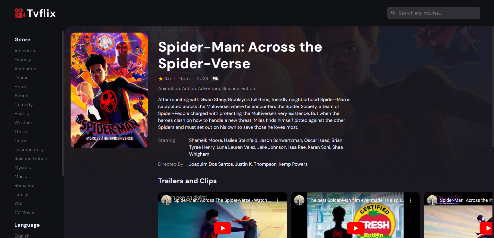

<h1 align="center" id="title">Tvflix</h1>

TVFlix is a website inspired by Netflix designed to replicate its user interface and functionality. Created using HTML CSS and JavaScript TVFlix offers a similar streaming experience where users can browse and watch a variety of TV shows and movies. Just like on Netflix you can explore different genres search for specific titles and enjoy a user-friendly interface. While it's not affiliated with Netflix TVFlix aims to provide a familiar streaming experience for users who enjoy online entertainment.

<h2>🚀 Demo</h2>

[https://flixxer.netlify.app/](https://flixxer.netlify.app/)

<h2>Project Screenshots:</h2>

*    Home page

*    Genre/Language Filter Page

*    Search Result Page

*    Movie Detail Page

  
<h2>🧐 Features</h2>

Here're some of the project's best features:

*   User-Friendly Interface
*   Responsive Design
*   Content Details
*   Ratings and Reviews
*   Frequent Updates

  
  
<h2>💻 Built with</h2>

Technologies used in the project:

    

